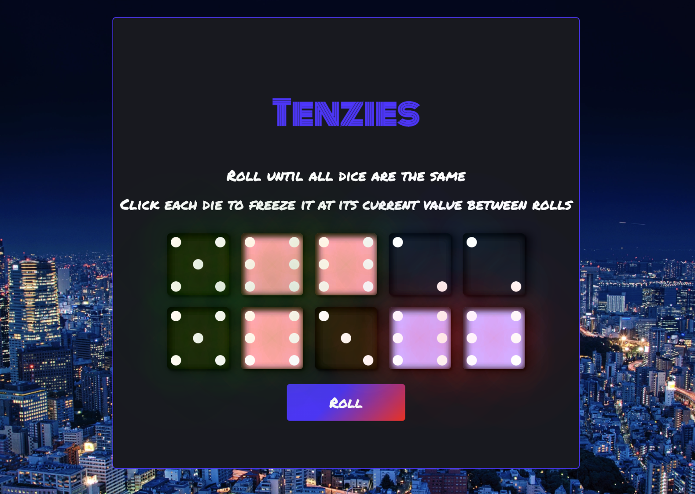
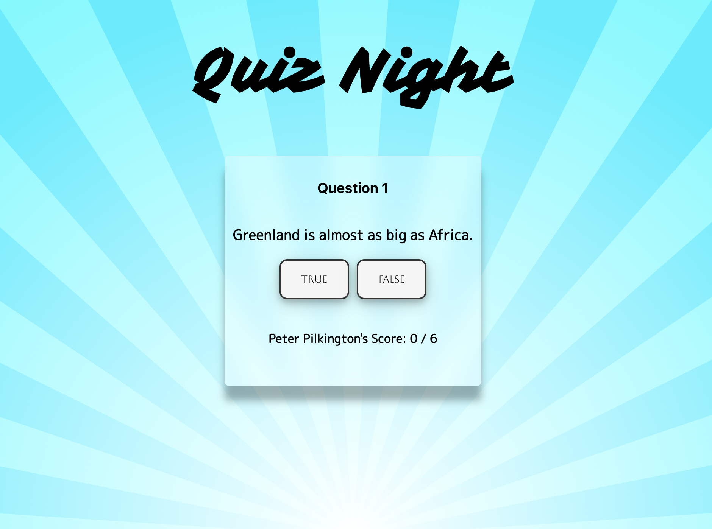

 

##  I’m Pete, welcome to my page! 
 
### :octocat: About me 
- 👀 I’m currently a full stack web developer trainee with futureproof. I'm interested in the role of technology changing the world for the better. I love learning, solving problems and all things web related.

- :earth_asia: As well as coding I enjoy travel off the beaten track, art , Studio Ghibli movies and reading.

- :computer: I’m currently learning **React & Redux** 

### Languages & Skills

 

 

### Projects

<h5>Tenzies</h5>

Dice game made with React

<h5>Quiz Night</h5>

Quiz game made with React

### Stats 

<!---
Pilks-pixel/Pilks-pixel is a ✨ special ✨ repository because its `README.md` (this file) appears on your GitHub profile.
You can click the Preview link to take a look at your changes.
--->
