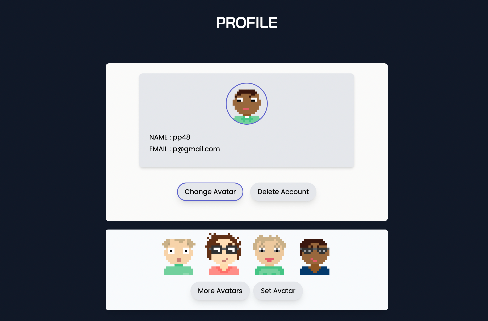
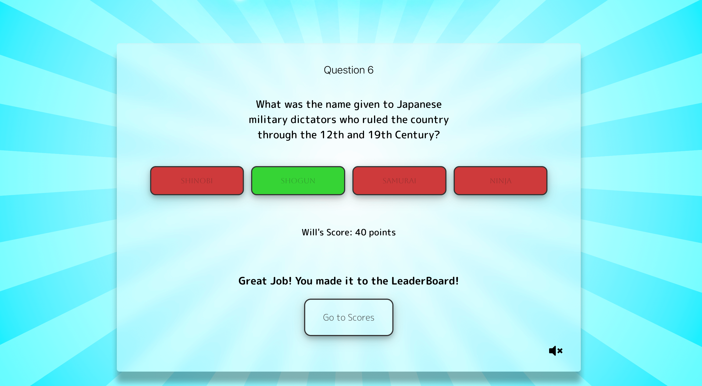
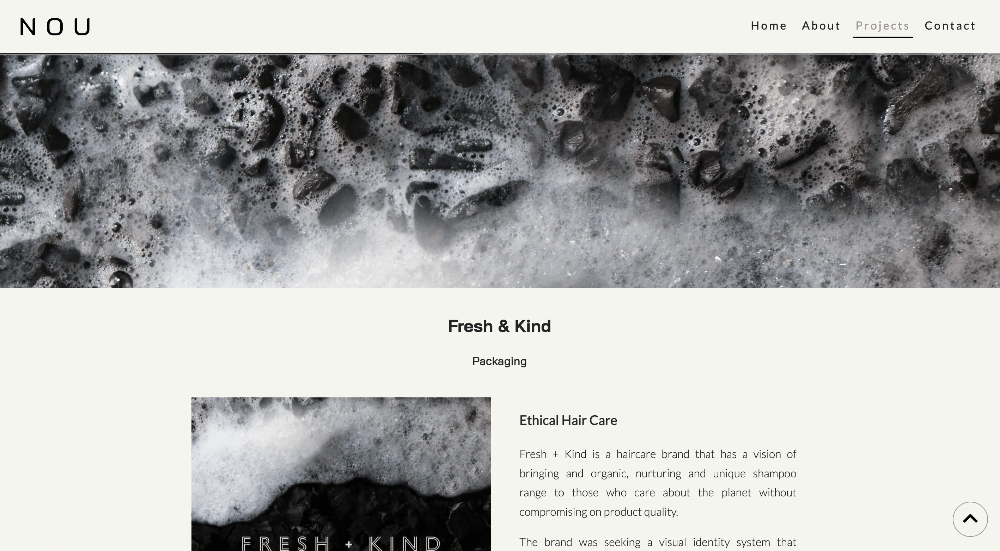

 

##  I’m Pete! 
 
### :octocat: About 
- 👀 I’m a self taught full stack developer, who is passonate about programming and using technology to solve problems. I love learning, freqently pushing myself out of my comfort zone and enthusiastic about improving my craft. 

- :alien_monster: As well as coding I enjoy travel off the beaten track, retro video games , Studio Ghibli movies and reading.

- :computer: Check out my portfolio   I’m currently learning **Typscript** 

### Languages & Skills

 

 

### Projects
<table align="center">
    <tr>
        <td valign="top" width="50%">
        

        <h5>Pixel Chat</h5>
        
        
Real Time Chat with Authentication / Authorization

        

        </td>
        <td valign="top" width="50%">
        

        <h5>Quiz Night</h5>
        
        
Quiz using React / React Router v6 / MongoDB / Node.js 

        

        </td>
    </tr>
        <td valign="top" width="50%">
        

        <h5>Nou Design</h5>
        
        
Responsive design / Web Animations API / Parallax scroll

        

        </td>
        <td valign="top" width="50%">
        

        <h5>Tenzies</h5>
        
        
Dice game made with React

        

        </td>
    <tr>
    </tr>
</table>

### Stats 

<!---
Pilks-pixel/Pilks-pixel is a ✨ special ✨ repository because its `README.md` (this file) appears on your GitHub profile.
You can click the Preview link to take a look at your changes.
--->
